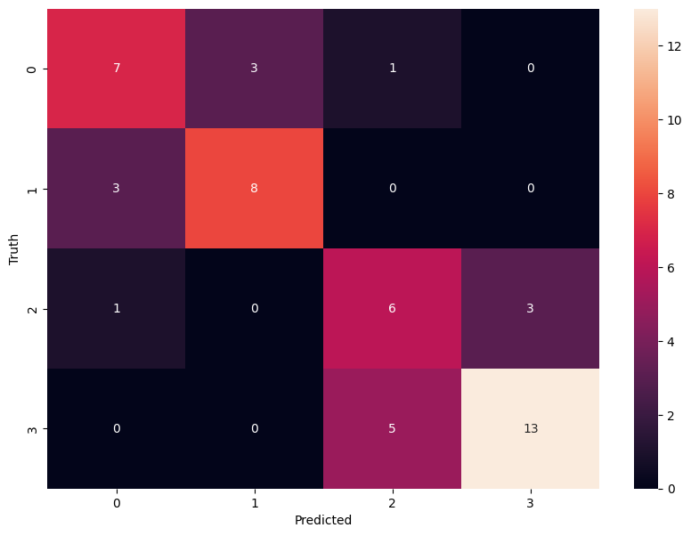

# Phân loại ca sĩ 
*Sơn Tùng - MTP, Hòa Minzi, Tăng Duy Tân, Hoàng Yến Chibi*

## Thu thập và xử lý dữ liệu 
* Thu thập bằng extension Fatkun: https://chromewebstore.google.com/detail/nnjjahlikiabnchcpehcpkdeckfgnohf
* Tiến hành xử lý: 
    - Dùng thư viện opencv cụ thể là Haar Cascade để detect ra khuôn mặt có đủ 2 mắt.
    - Lưu khuôn mặt đó vào 1 thư mục riêng.
    - Chuyển đổi wavelet để trích xuất đặc trưng quan trọng.
## Train model, fine tuned và lưu model
* Train model và fine tuned model:
    - Dùng SVM để train
    - Dùng Grid Search để fine tuned (SVM, Logistic Regression, Random Forest Classifier )
* Lưu model 
    - Lưu model tốt nhất bằng thư viện joblib
## Kết quả Confusion Matrix

## Dùng Flash server để chạy backend
## UI với html, css
## Xử lý logic với Javascript

## Thuận lợi
- Được hướng dẫn chi tiết.
- Kiến thức cơ bản
- Data còn ít chưa phải xữ lý nhiều
- Project còn đơn giản mang tính chất làm quen
## Khó khăn
- Thu thập dữ liệu bị trỡ ngại do nhiều hình ảnh không khớp từ khóa.
- Trong quá trình thực hiện gặp nhiều bug vì không dùng chung phần mềm code.
- Ảnh thu thập được ít, có thể trùng nên kết quả chưa tốt.
- Chưa đa dạng model train.
## Dự định tương lai
- Chỉnh sửa phương pháp trích xuất đặc trưng mới.
- Dùng Model DeepLearning để train lại và so sánh kết quả.

**Nguồn Video Hướng dẫn**: Project 2: https://youtube.com/playlist?list=PLeo1K3hjS3uvCeTYTeyfe0-rN5r8zn9rw&si=Nl43aAlPwAO1rPCZ